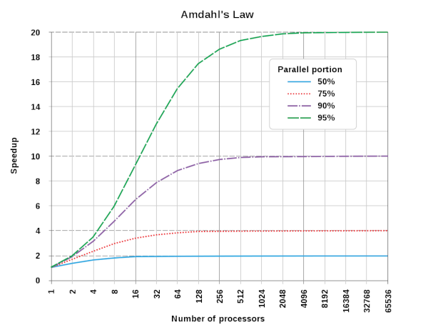
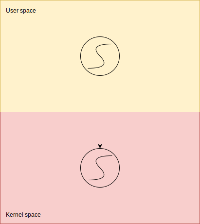
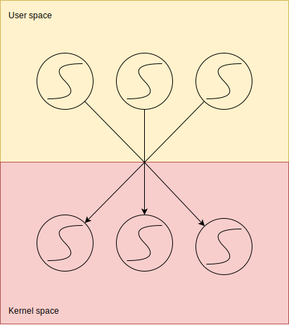

# Agenda

- 📔 Theory
  <!-- - What is a thread. -->
  <!-- - Thread models -->
- 🦀 Threads API
  <!-- - Creation -->
  <!-- - Move data to threads -->
    <!-- - Lifetimes -->
    <!-- - Move -->
    <!-- - Channels -->
  <!-- - Synchronization -->
- ⚠️ Pitfalls
    <!-- - What Rust avoids -->
    <!-- - What we need to be careful about -->
- 🏗 Patterns
  <!-- - Thread Pool -->
  <!-- - Actors -->
- 🔎 Others

---

## 📔 Parallelism vs Concurrency


---

# 📔 Amdahl's Law

.middle[## $$S = { 1 \over { s + p \over N }}$$]

.left[
S: Time improvement  
s: Secuential bit of the program  
p: Parallel part of the program  
N: Number of processors 
]

---

# 📔 Amdahl's Law

.center[]

---


class: center, middle

# First thread in Rust
 
---

## 🦀 Threads API :: Creation

**Spawn**
```rs
use std::thread;

thread::spawn(|| {
    // some work here
});

```

--

**Builder API**

```rs
use std::thread;

let builder = thread::Builder::new();

let handler = builder.spawn(|| {
    // some work here
}).unwrap();

handler.join().unwrap();
```
- Change name of thread
- Change the stack size (default 2Mb)

---
class: center, middle

# First thread in Rust

**examples/01_create_thread.rs**

--

`cargo run --example 01_create_thread`

---

## 🦀 Threads API :: Join

```rs
use std::thread;

let child = thread::spawn(|| {
    // some work here
});
// some work here
let res = child.join(); // Unhandled
```

---

class: center, middle

# What is a thread?

---

## 📔 Processes & Threads

.center[]

---

## 📔 Kernel & User threads

.center[]

---

class: middle, center

# Thread Models

---

## 📔 1:1 Threads

.center[]

---

## 📔 N:1 Threads

.center[]

---

## 📔 N:M Threads

.center[]

---

class: middle, center

# The cost of spawning a thread/

**benches/01_hello_world.rs**  
**examples/02_thread_mem.rs**

---

class: center, middle

## 🔎 History: The RFC that removes Green Threads

[https://github.com/aturon/rfcs/blob/remove-runtime/active/0000-remove-runtime.md](https://github.com/aturon/rfcs/blob/remove-runtime/active/0000-remove-runtime.md)

---


class: center, middle

# Moving state around threads

---

## 🦀 Threads API :: Move

```rs
use std::thread;

thread::spawn(move || {
    // some work here
});
```

### ⚠️ Note
- The data must have the `'static` lifetime.
- Data must implement `Send`.
- If the data will be shared between threads it has to implement `Sync`.

--

### 🔎 Leakpocalypse

Why everything must be static if we can join threads?

[Leakpocalypse](http://cglab.ca/~abeinges/blah/everyone-poops/)

---

### ⚠️ Send & Sync

- raw pointers are neither Send nor Sync (because they have no safety guards).
- UnsafeCell isn't Sync (and therefore Cell and RefCell aren't).
- Rc isn't Send or Sync (because the refcount is shared and unsynchronized).
- Wrapping the value in a `Mutex` makes it `Sync`, but it must already implement `Send`.

--

### 🦀 Threads API :: Implementing Send & Sync
```rs
struct MyBox(*mut u8);

unsafe impl Send for MyBox {}
unsafe impl Sync for MyBox {}
```

---

class: middle, center

# Move state lifetimes & threads

**examples/04_thread_lifetimes.rs**

---

class: center, middle

# Sharing state across threads

---

## 🦀 Threads API :: Arc

```rs
use std::sync::Arc;
let foo = Arc::new(vec![1.0, 2.0, 3.0]);
// The two syntaxes below are equivalent.
let a = foo.clone();
let b = Arc::clone(&foo);
// a, b, and foo are all Arcs that point to the same memory location
```

### ⚠️ Gotchas

- `Arc<T>` makes the reference counter thread safe, not T.
- `Arc<T>` is a smart pointer that dereferences to `T`.
- As with `Rc<T>` you can create circular references that will never be deallocated.

---

class: center, middle

# Sharing state across threads

**examples/04_arc.rs**

---

## 🦀 Threads API :: Mutex

```rs
use std::sync::Mutex;

fn main() {
    let m = Mutex::new(5);

    {
        let mut num = m.lock().unwrap();
        *num = 6;
    }

    println!("m = {:?}", m);
}
```

- If you need to recover the value after finishing with the mutex you can do `to_inner`on it.

---

class: center, middle

# Sharing state across threads

**examples/05_mutex.rs**

**examples/06_arc_mut.rs**

**examples/07_parallel_map.rs**

<!-- TODO: Local thread storage. How does it work, how do we use it? -->

---

### ⚠️ Mutex poisoning

- Mutex `lock` returns a Result indicating if the mutex has been poisoned. A pattern here is to simply unwrap, propagating panics.
- The `PoisonError` has an `into_inner` which returns the data anyway. Handle with care.

<!-- TODO: Exercises on Mutex poisoning -->

---

## 🦀 Threads API :: Channels

```rs
use std::sync::mpsc::channel;
use std::thread;

let (sender, receiver) = channel();

// Spawn off an expensive computation
thread::spawn(move|| {
    sender.send(expensive_computation()).unwrap();
});

// Do some useful work for awhile

// Let's see what that answer was
println!("{:?}", receiver.recv().unwrap());
```

- Async channels have a dynamic buffer size.
- Both the sender and receiver implement Send. But either implements Sync.
- It is possible to clone the sender. You can only have one receiver per channel.

---

# Channels

**examples/08_receiver_channel.rs**
**examples/09_thread_pool.rs**

---

## Threadpool

- No need to spawn new treads. Reduce runtime cost by pre-spawning the threads.
- Keeps memory on check.